# Project Structure Visualization

```
Projet-technique-/
│
├── 📄 README.md
├── 📄 PROJECT_STRUCTURE.md
│
├── 📁 conception/
│   └── diagramme_class.mmd
│
├── 📁 doc/
│   └── structure.md
│
├── 📁 fonctionalite/
│   └── usecase.plantuml
│
├── 📁 images/
│
├── 📁 mini-ecommerce/ ⭐ MAIN PROJECT
│   ├── 📄 artisan
│   ├── 📄 composer.json
│   ├── 📄 package.json
│   ├── 📄 phpunit.xml
│   ├── 📄 README.md
│   ├── 📄 vite.config.js
│   │
│   ├── 📁 Agent/
│   │   ├── Agent Lang/
│   │   └── Agent UnitTest/
│   │
│   ├── 📁 app/
│   │   ├── Http/
│   │   ├── Models/
│   │   ├── Providers/
│   │   └── Services/
│   │
│   ├── 📁 bootstrap/
│   │   ├── app.php
│   │   ├── providers.php
│   │   └── cache/
│   │
│   ├── 📁 config/
│   │   ├── app.php
│   │   ├── auth.php
│   │   ├── cache.php
│   │   ├── database.php
│   │   ├── filesystems.php
│   │   ├── logging.php
│   │   ├── mail.php
│   │   ├── queue.php
│   │   ├── services.php
│   │   └── session.php
│   │
│   ├── 📁 database/
│   │   ├── factories/
│   │   ├── migrations/
│   │   └── seeders/
│   │
│   ├── 📁 lang/
│   │   ├── en/
│   │   └── fr/
│   │
│   ├── 📁 public/
│   │   ├── hot
│   │   ├── index.php
│   │   ├── robots.txt
│   │   ├── build/
│   │   └── images/
│   │
│   ├── 📁 resources/
│   │   ├── css/
│   │   ├── js/
│   │   └── views/
│   │
│   ├── 📁 routes/
│   │   ├── console.php
│   │   └── web.php
│   │
│   ├── 📁 storage/
│   │   ├── app/
│   │   ├── framework/
│   │   └── logs/
│   │
│   ├── 📁 tests/
│   │   ├── TestCase.php
│   │   ├── Feature/
│   │   └── Unit/
│   │
│   └── 📁 vendor/
│       └── [Dependencies: Laravel, PHPUnit, etc.]
│
├── 📁 prototype/ (BACKUP/PROTOTYPE)
│   ├── 📄 artisan
│   ├── 📄 composer.json
│   ├── 📄 package.json
│   ├── 📄 phpunit.xml
│   ├── 📄 test_debug.txt
│   ├── 📄 test_output.txt
│   ├── 📄 vite.config.js
│   ├── 📁 Agent/
│   ├── 📁 app/
│   ├── 📁 bootstrap/
│   ├── 📁 config/
│   ├── 📁 database/
│   ├── 📁 lang/
│   ├── 📁 public/
│   ├── 📁 resources/
│   ├── 📁 routes/
│   ├── 📁 storage/
│   ├── 📁 tests/
│   └── 📁 vendor/
│
└── 📁 prototype_livecoding/ (BACKUP/PROTOTYPE)
    ├── 📄 artisan
    ├── 📄 composer.json
    ├── 📄 package.json
    ├── 📄 phpunit.xml
    ├── 📄 test_debug.txt
    ├── 📄 test_output.txt
    ├── 📄 vite.config.js
    └── [Similar structure to prototype]
```

---

## 📊 Architecture Overview (Color-Coded)

```mermaid
graph TB
    A["🏠 Projet-technique-"]
    
    A --> B["<b>mini-ecommerce</b><br/>(Main Project)"]
    A --> C["prototype"]
    A --> D["prototype_livecoding"]
    A --> E["conception"]
    A --> F["doc"]
    A --> G["fonctionalite"]
    
    B --> B1["<b>app</b><br/>Application Logic"]
    B --> B2["<b>config</b><br/>Configuration"]
    B --> B3["<b>database</b><br/>Migrations & Seeds"]
    B --> B4["<b>resources</b><br/>Frontend Assets"]
    B --> B5["<b>routes</b><br/>Web Routing"]
    B --> B6["<b>tests</b><br/>PHPUnit Tests"]
    B --> B7["<b>storage</b><br/>Logs & Cache"]
    B --> B8["<b>Agent</b><br/>Custom Agents"]
    B --> B9["<b>bootstrap</b><br/>Bootstrap"]
    B --> B10["<b>public</b><br/>Public Assets"]
    
    B1 --> B1a["Http/"]
    B1 --> B1b["Models/"]
    B1 --> B1c["Services/"]
    B1 --> B1d["Providers/"]
    
    B4 --> B4a["views/"]
    B4 --> B4b["css/"]
    B4 --> B4c["js/"]
    
    B3 --> B3a["migrations/"]
    B3 --> B3b["seeders/"]
    B3 --> B3c["factories/"]
    
    B6 --> B6a["Feature/"]
    B6 --> B6b["Unit/"]
    
    style A fill:#ff6b6b,stroke:#c92a2a,stroke-width:3px,color:#fff
    style B fill:#4ecdc4,stroke:#0b7285,stroke-width:2px,color:#fff
    style C fill:#95a5a6,stroke:#34495e,stroke-width:1px,color:#fff
    style D fill:#95a5a6,stroke:#34495e,stroke-width:1px,color:#fff
    style E fill:#f39c12,stroke:#d68910,stroke-width:1px,color:#fff
    style F fill:#f39c12,stroke:#d68910,stroke-width:1px,color:#fff
    style G fill:#f39c12,stroke:#d68910,stroke-width:1px,color:#fff
    
    style B1 fill:#3498db,stroke:#2c3e50,stroke-width:1px,color:#fff
    style B2 fill:#9b59b6,stroke:#6c3483,stroke-width:1px,color:#fff
    style B3 fill:#e74c3c,stroke:#c0392b,stroke-width:1px,color:#fff
    style B4 fill:#2ecc71,stroke:#27ae60,stroke-width:1px,color:#fff
    style B5 fill:#f1c40f,stroke:#f39c12,stroke-width:1px,color:#000
    style B6 fill:#1abc9c,stroke:#16a085,stroke-width:1px,color:#fff
    style B7 fill:#e67e22,stroke:#d35400,stroke-width:1px,color:#fff
    style B8 fill:#c0392b,stroke:#a93226,stroke-width:1px,color:#fff
    style B9 fill:#34495e,stroke:#2c3e50,stroke-width:1px,color:#fff
    style B10 fill:#5d6d7b,stroke:#34495e,stroke-width:1px,color:#fff
    
    style B1a fill:#3498db,stroke:#2c3e50,stroke-width:1px,color:#fff
    style B1b fill:#3498db,stroke:#2c3e50,stroke-width:1px,color:#fff
    style B1c fill:#3498db,stroke:#2c3e50,stroke-width:1px,color:#fff
    style B1d fill:#3498db,stroke:#2c3e50,stroke-width:1px,color:#fff
    
    style B4a fill:#2ecc71,stroke:#27ae60,stroke-width:1px,color:#fff
    style B4b fill:#2ecc71,stroke:#27ae60,stroke-width:1px,color:#fff
    style B4c fill:#2ecc71,stroke:#27ae60,stroke-width:1px,color:#fff
    
    style B3a fill:#e74c3c,stroke:#c0392b,stroke-width:1px,color:#fff
    style B3b fill:#e74c3c,stroke:#c0392b,stroke-width:1px,color:#fff
    style B3c fill:#e74c3c,stroke:#c0392b,stroke-width:1px,color:#fff
    
    style B6a fill:#1abc9c,stroke:#16a085,stroke-width:1px,color:#fff
    style B6b fill:#1abc9c,stroke:#16a085,stroke-width:1px,color:#fff
```



### 🎨 Color Legend

| Color | Category |
|-------|----------|
| 🔴 Red | Main Project Root |
| 🔵 Teal | Main Application |
| 🔴 Blue | Application Logic (HTTP, Models, Services) |
| 🟣 Purple | Configuration |
| 🔴 Red | Database (Migrations, Seeds) |
| 🟢 Green | Frontend Resources (Views, CSS, JS) |
| 🟡 Yellow | Routes & Web |
| 🔵 Teal | Tests (Unit, Feature) |
| 🟠 Orange | Storage (Logs, Cache) |
| 🔴 Dark Red | Custom Agents |
| ⚫ Dark | Bootstrap & Public |
| 🟤 Gray | Backup/Prototypes |
| 🟠 Orange | Documentation |

---

## 🎯 Project Stack

- **Framework**: Laravel (Modern PHP Framework)
- **Frontend**: Vite + Vue.js (or similar)
- **Database**: Configured in config/database.php
- **Testing**: PHPUnit
- **Package Manager**: Composer (PHP) + NPM (JavaScript)
- **Localization**: Multi-language support (EN, FR)

---

## 📌 Key Directories

| Directory | Purpose |
|-----------|---------|
| `mini-ecommerce/` | Main e-commerce application |
| `prototype/` | Backup/prototype version |
| `prototype_livecoding/` | Backup/livecoding version |
| `app/` | Application core (Models, Controllers, Services) |
| `config/` | Configuration files |
| `database/` | Migrations, Factories, Seeders |
| `resources/` | Frontend assets (Views, CSS, JS) |
| `routes/` | Application routing |
| `tests/` | Unit & Feature tests |
| `Agent/` | Custom agent implementations |

