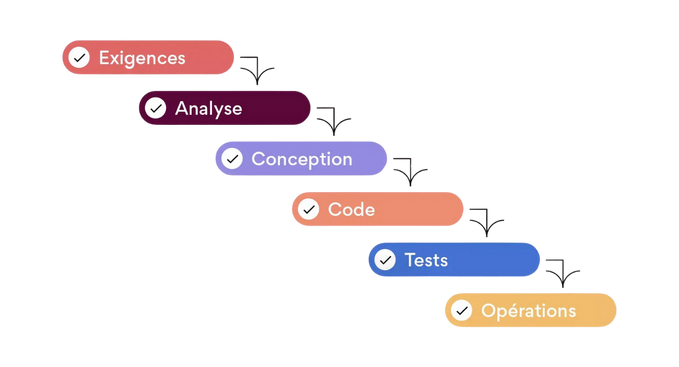
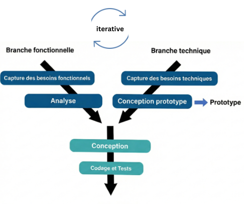
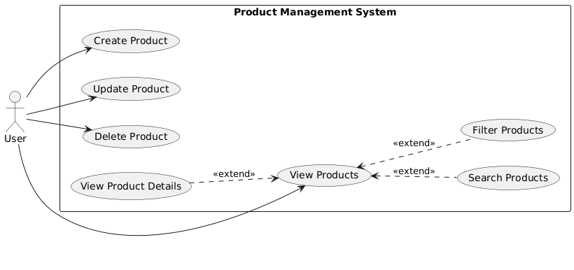
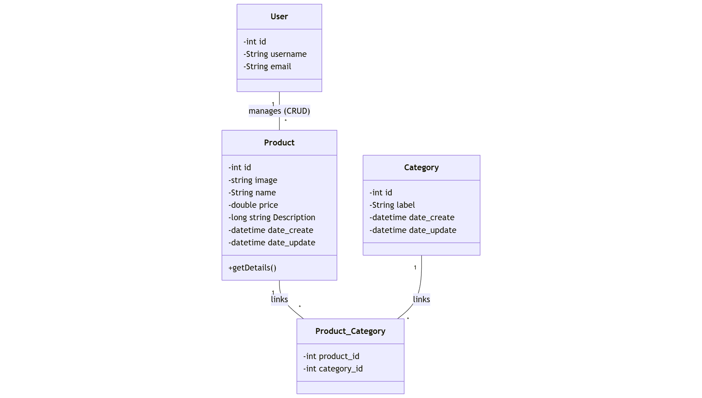

# **Présentation Projet-technique**
### Mini E-Commerce (Product,Categories)
**Réalisé par :** Ben Taleb Mehdi  
**Encadré par :** M. ESSARRAJ Fouad
**Date :** 05/01/2026

---

## Exigences: Travail à faire

**Développer l'Application Mini E-Commerce (Product/Categories)**

* **Partie Publique :** Interface permettant aux visiteurs de consulter les produits et leurs catégories. 
    * **Fonctionnalités :** pagination (10 produits/page).
* **Partie Admin :** Tableau de bord sécurisé pour la gestion complète du catalogue (CRUD). 
    * **Fonctionnalités :** Modales pour l’ajout et l’édition d'éléments, intégration de AJAX - Alpine.js pour les mises à jour asynchrones (sans rechargement de page).

---
## Waterfall 

---
## Contexte 

---
## Analyse Technique

### Les Technologies a Utiliser (parte 1)
1. Base de donnee : Mysql 
2. Archittecture N-tier : Services
3. Framwork : Laravel
4. Archittecture : MVC
5. Moteur de vues Blade
6. AJAX 
---
### Les Technologies a Utiliser (parte 2)
7. Upload image
8. Laravel Multilingue
9. Vite
10. Preline Ui
11. Lucide Library (icons)
12. Alpine
13. spatie
14. laravel/ui

---

## Analyse - Fonctionnalités

---

## Conception 

---

## Sujet - Live coding
- Un bouton “Ajouter” qui ouvre une modale pour créer un nouvel élément.
- Une barre de recherche filtrant des éléments par titre.

---

## Versions

| Version | Branch Name | Code Version / Tags |
| :--- | :--- | :--- |
| **v1: Public Side** | `public` | — |
| **v2: Admin Side** | `admin` | `prototype-admin`, `live-coding-admin` |
| **v3: Authentication / Authorization (Gates)** | `gates` | — |
| **v4: SPA (AJAX, Alpine)** | `ajax, alpine` | `prototype-ajax`, `live-coding-ajax` |
| **v5: Spatie Authorization** | `spatie` | `live-coding-spatie` |
| **v6: API** | `api` | — |
| **v7: Mobile** | `mobile` | — |
